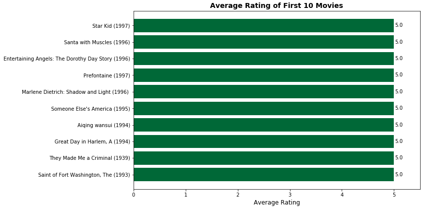
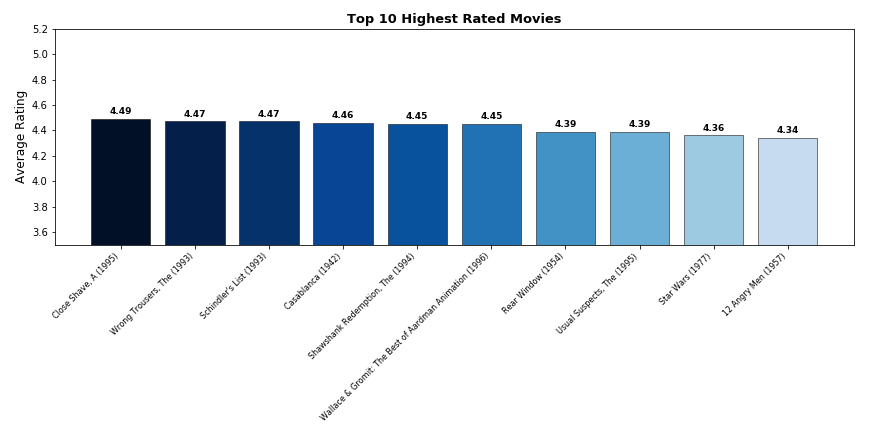
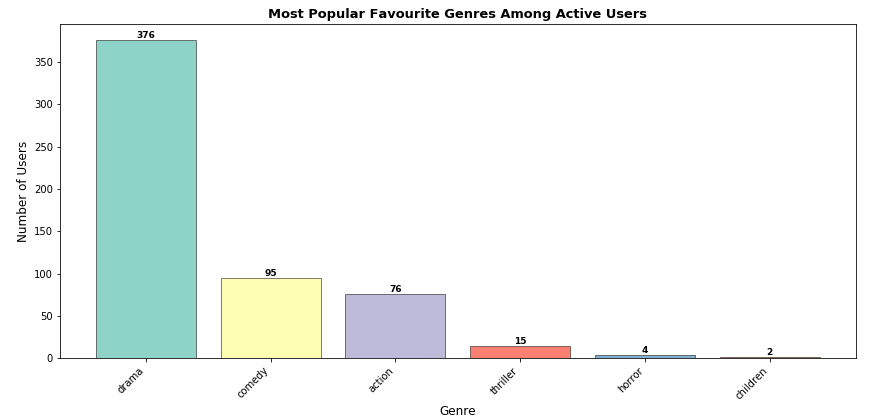
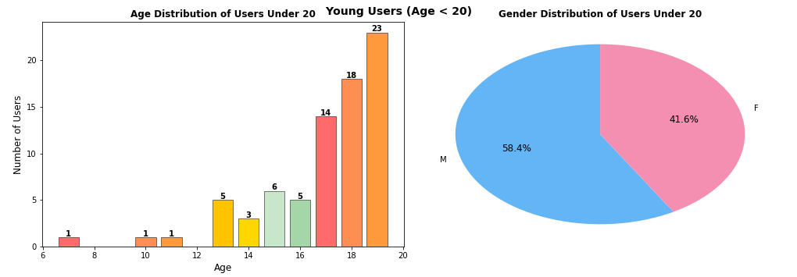
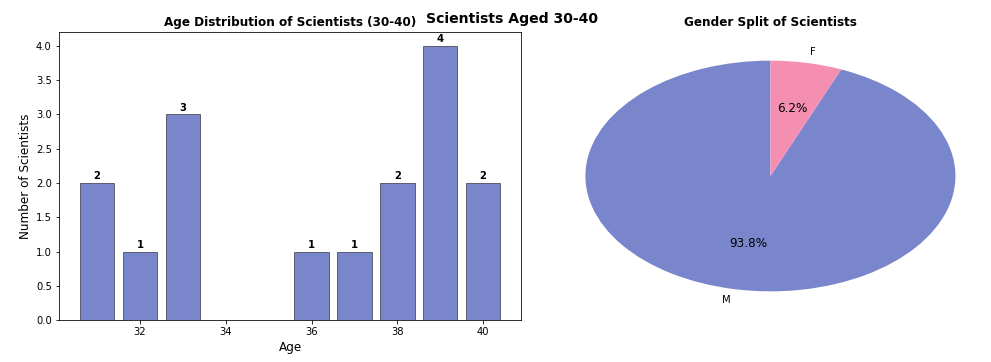

# MovieLens-100k Analysis using Apache Spark + Cassandra 🎬

---
## 📖 Project Overview

This project was developed for **STQD6324 Data Management Assignment 2**. The objective is to build a distributed data pipeline using **Apache Spark** and **Cassandra** to analyze the MovieLens 100K dataset.


## 🛠️ Software Environment

| Component | Version | Purpose |
|-----------|---------|---------|
| Apache Spark | 2.3.0 | Distributed data processing |
| Apache Cassandra | 3.11.x | NoSQL database storage |
| PySpark | 2.3.0 | Python API for Spark |
| HDFS | 2.6.5 | Distributed file storage |
| Apache Zeppelin | 0.7.3 | Notebook environment |
| Python | 2.7.x | Programming language |
| Matplotlib | 2.2.5 | Data visualization |
| HDP Sandbox | 2.6.5 | Hadoop platform |

---

## 📂 Dataset

Dataset: MovieLens 100K

Files used:

* `u.data` – User movie ratings
* `u.user` – User demographic information
* `u.item` – Movie information and genres

Dataset Source:

https://grouplens.org/datasets/movielens/

---

## 🔄 Project Workflow

```text
MovieLens Dataset
       │
       ▼
Upload to HDFS
       │
       ▼
Create Spark RDDs
       │
       ▼
Convert to DataFrames
       │
       ▼
Data Cleaning & Preprocessing
       │
       ▼
Spark SQL Analytics
       │
       ▼
Write Results to Cassandra
       │
       ▼
Read Back for Validation
```
---
## 📁 Repository Structure

```text
STQD6324-Assignment2/
│
├── README.md
├── P161828_Assignment2_MovieLens_Analysis.json
│
├── screenshots/
│   ├── task_i_output.png
│   ├── task_ii_output.png
│   ├── task_iii_output.png
│   ├── task_iv_output.png
│   ├── task_v_output.png
│   ├── task_i_visual.png
│   ├── task_ii_visual.png
│   ├── task_iii_visual.png
│   ├── task_iv_visual.png
│   └── task_v_visual.png
│
└── setup.cql
```

---

# 📊 Analytical Tasks

---

## 🎬 Task (i): Average Rating for Each Movie

### Objective

Calculate the average rating received by every movie in the dataset.

### Method

* Join ratings data with movie titles.
* Group records by movie.
* Compute:

  * Average rating
  * Number of ratings

### Results
<p align="center">
  <a href="screenshots/task_i_output.png">
    
  </a>
</p>

### Visualization
<p align="center">
  <a href="screenshots/task_i_visual.png">
    
  </a>
</p>

### Interpretation

Several movies achieved a perfect average rating of 5.0. However, these movies received very few ratings, making their averages less reliable indicators of overall popularity. Therefore, rating frequency should also be considered when evaluating movie quality.

---

## ⭐ Task (ii): Top 10 Highest Rated Movies

### Objective

Identify the highest-rated movies based on average ratings.

### Method
- Calculated average ratings for all movies.
- Filtered movies with sufficient rating counts (>10).
- Ranked movies by average rating in descending order.
  
### Top 10 Movies
<p align="center">
  <a href="screenshots/task_ii_output.png">
    
  </a>
</p>

### Visualization
<p align="center">
  <a href="screenshots/task_ii_visual.png">
    
  </a>
</p>

### Interpretation

The results reveal that several critically acclaimed films dominate the highest-rated list. Classic movies such as *Casablanca*, *12 Angry Men*, and *Rear Window* remain highly appreciated by users despite their age, which indicates enduring audience appeal.

---

## 🎭 Task (iii): Favourite Genre of Active Users

### Objective

Identify users who rated at least 50 movies and determine their favourite genre.

### Method
- Selected users with at least 50 movie ratings.
- Joined rating information with movie genre information.
- Counted genre occurrences for each user.
- Selected the most frequently rated genre as the user's favourite genre.
  
### Results Summary

* Active Users Identified: **568 users**
* Some of favourite genres observed:

  * Drama
  * Comedy
  * Action

<p align="center">
  <a href="screenshots/task_iii_output.png">
    
  </a>
</p>

### Visualization
<p align="center">
  <a href="screenshots/task_iii_visual.png">
    
  </a>
</p>

### Interpretation

**Drama** emerged as the most common favourite genre among active users. This suggests that users who engage heavily with the platform tend to consume a wide variety of dramatic content. **Comedy** also appeared frequently, indicating broad audience preference.

---

## 👦 Task (iv): Users Below 20 Years Old

### Objective

Identify all users younger than 20 years old.

### Method
- Filtered the user dataset based on age.
- Selected records where age < 20.
  
### Results

* Total Users Below 20: **77 users**
<p align="center">
  <a href="screenshots/task_iv_output.png">
    
  </a>
</p>

### Visualization
<p align="center">
  <a href="screenshots/task_iv_visual.png">
    
  </a>
</p>

### Observation

The majority of users below 20 years old were students, indicating that younger audiences form an important segment of the MovieLens user base.

### Interpretation

The prevalence of students among younger users is expected due to their higher engagement with entertainment media and online recommendation systems.

---

## 🔬 Task (v): Scientists Aged Between 30 and 40

### Objective

Identify users whose occupation is scientist and whose age falls between 30 and 40 years.

### Method
- Filtered users based on occupation.
- Selected only users with occupation = scientist.
- Applied an age filter between 30 and 40 years old.
- 
### Results

* Total Scientists Aged 30–40: **16 users**

<p align="center">
  <a href="screenshots/task_v_output.png">
    
  </a>
</p>

### Visualization
<p align="center">
  <a href="screenshots/task_v_visual.png">
    
  </a>
</p>

### Interpretation

The scientist user group represents a relatively small proportion of the dataset. Most identified users were male, although female scientists were also represented within the selected age range.

---

# 🗄️ Cassandra Data Storage

The analytical outputs were stored in Cassandra for persistence and validation.

| Table           | Purpose                         |
| --------------- | ------------------------------- |
| avg_ratings     | Average movie ratings           |
| top_movies      | Top 10 highest-rated movies     |
| user_fav_genre  | Favourite genre of active users |
| young_users     | Users below 20 years old        |
| scientist_users | Scientists aged 30–40           |

After insertion, all Cassandra tables were read back into Spark DataFrames to verify successful storage.

---

# ▶️ Reproducibility

### 1. Upload Dataset to HDFS

Upload the following MovieLens files into HDFS:

* `u.data`
* `u.user`
* `u.item`

---

### 2. Start Cassandra

Open PuTTY and run:

```bash
su root
service cassandra start
cqlsh
```

Execute the commands in `setup.cql` to create:

* Keyspace: `movielens`
* Tables:

  * `avg_ratings`
  * `top_movies`
  * `user_fav_genre`
  * `young_users`
  * `scientist_users`

After the tables have been created, exit Cassandra:

```bash
exit
```

---

### 3. Import and Run Zeppelin Notebook

Open Zeppelin:

```text
http://localhost:9995
```

1. Click **Import Note**
2. Upload `P161828_Assignment2_MovieLens_Analysis.json`
3. Open the imported notebook
4. Run all cells sequentially from top to bottom
5. Wait for each cell to complete before executing the next cell

---

### 4. Validate Results

The notebook will:

* Load data from HDFS into Spark
* Create RDDs and DataFrames
* Perform data preprocessing
* Execute Spark SQL analytical queries
* Write processed results into Cassandra
* Read Cassandra tables back into Spark for validation

Successful execution should produce outputs for all five analytical tasks and display validation results from Cassandra.

---

# 🎯 Conclusion

This project successfully demonstrates the integration of Apache Spark and Cassandra for large-scale analytical processing. Using distributed computing techniques, the MovieLens dataset was transformed into meaningful insights regarding movie ratings, user preferences, demographic patterns, and genre interests. The workflow highlights how big data technologies can be combined to create scalable and efficient analytics pipelines.


